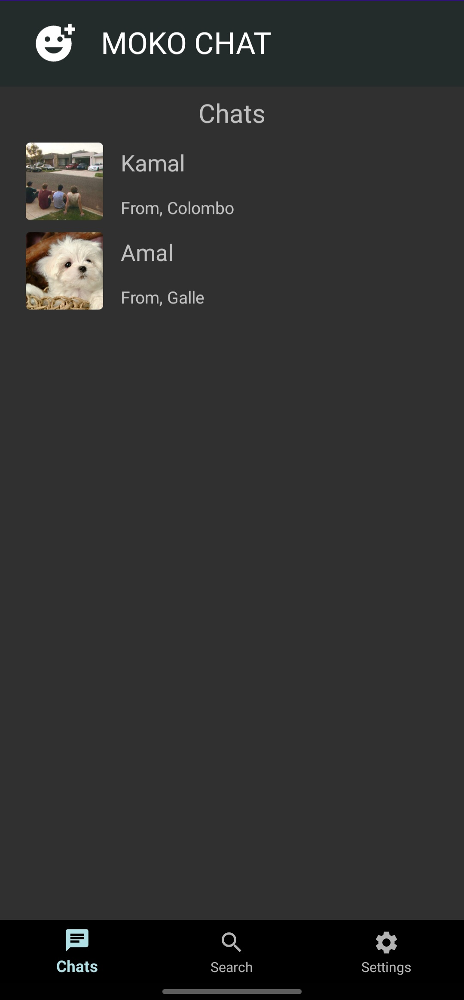
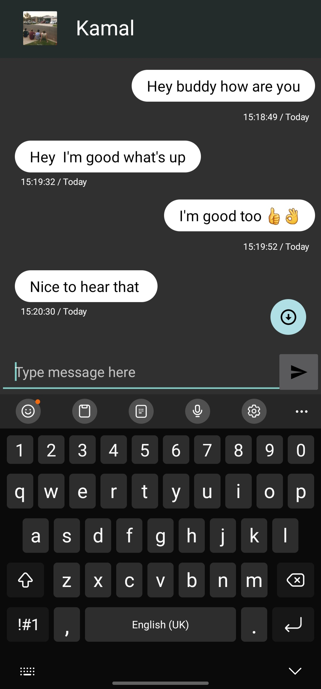
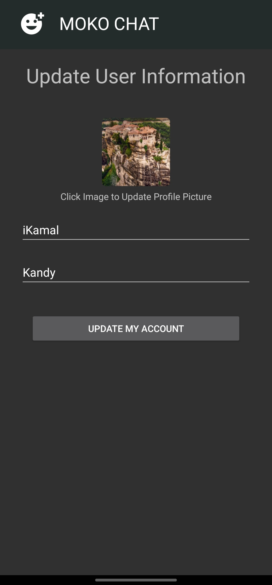
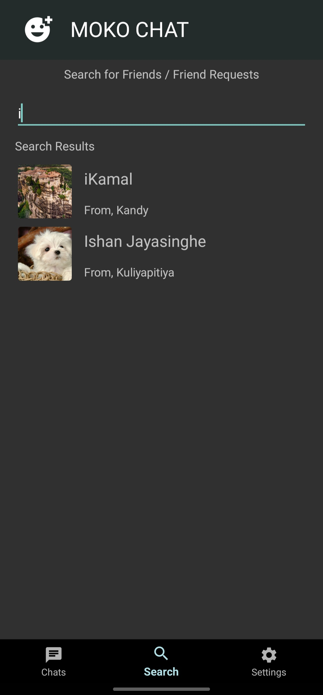
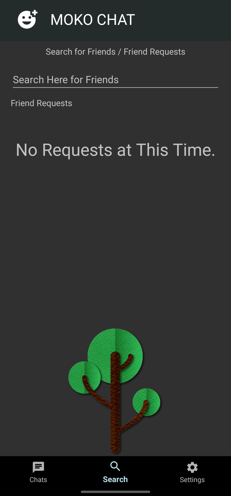

<h2>MOKO Chat</h2>
<h3>Language --> Android - JAVA</h3>
This project is about a Android chat app called Moko Chat. I built same kind of app few years back but I lost keep of it and I thought to built it from scratch. But this time I developed this app with better features and better software development practices. And this is a fun project of mine so enjoy the app.
<h1></h1>

In this app you can do things like,

    1. Register and Login app with your phone number.
    2. Update User Information like Name, Home Town and profile picture.
    3. Search for New Friends.
    4. Send Friend Requests.
    5. Accept or Delete Friend Requests.
    6. Chat with Friends.
    7. Unfriend Users.

Here is some screenshots of the app,

<h1></h1>

You will able to download and enjoy this app through the Android Play Store soon.

Until then, Have a great time.

<a href-"Https://ishanj.lk">Visit my personal website</a>
<h2>IshanJ</h2>
<h1></h1>